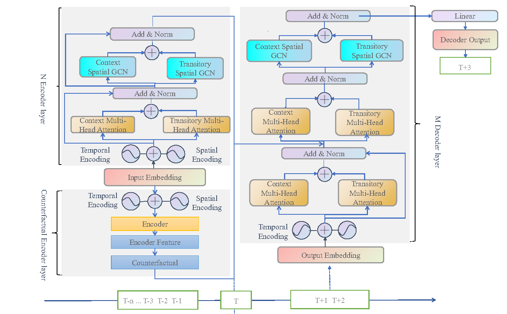

# CESTGNN

This is a Pytorch implementation of Causal Spatio-Temporal Graph Foresting Against
Confounding Bias (CSTCB). 


# Train and Test

We take the commands on PEMS04 for example.

Step 1: Process dataset:

- for CESTGNN

```python
python prepareData.py --config configurations/PEMS04.conf
```

- for CESTGNN(p)

```python
python prepareData.py --config configurations/PEMS04_rdw.conf
```

Step 2: train and test the model:

- for CESTGNN

```python
nohup python -u train_CESTGNN.py --config configurations/PEMS03.conf --cuda=0 > "pems03_$(date +%Y%m%d%H%M%S).out"  &
```

```python
nohup python -u train_CESTGNN.py --config configurations/PEMS04.conf --cuda=1 > "pems04_$(date +%Y%m%d%H%M%S).out"  &
```

```python
nohup python -u train_CESTGNN.py --config configurations/PEMS07.conf --cuda=2 > "pems07_$(date +%Y%m%d%H%M%S).out"  &
```

```python
nohup python -u train_CESTGNN.py --config configurations/PEMS08.conf --cuda=2 > "pems08_$(date +%Y%m%d%H%M%S).out" &
```

- for CESTGNN(p)

```python
nohup python -u train_CESTGNN.py --config configurations/PEMS03_rdw.conf --cuda=1 > "pems03_$(date +%Y%m%d%H%M%S)_rdw.out"  &
```
```python
nohup python -u train_CESTGNN.py --config configurations/PEMS04_rdw.conf --cuda=1 > "pems04_$(date +%Y%m%d%H%M%S)_rdw.out"  &

```
```python
nohup python -u train_CESTGNN.py --config configurations/PEMS07_rdw.conf --cuda=1 > "pems07_$(date +%Y%m%d%H%M%S)_rdw.out"  &
```
```python
nohup python -u train_CESTGNN.py --config configurations/PEMS08_rdw.conf --cuda=1 > "pems08_$(date +%Y%m%d%H%M%S)_rdw.out"  &
```

The settings for each experiments are given in the "configurations" folder.

